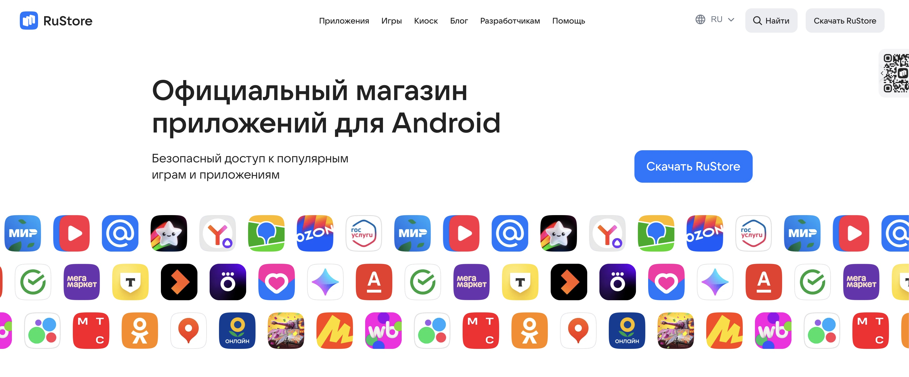
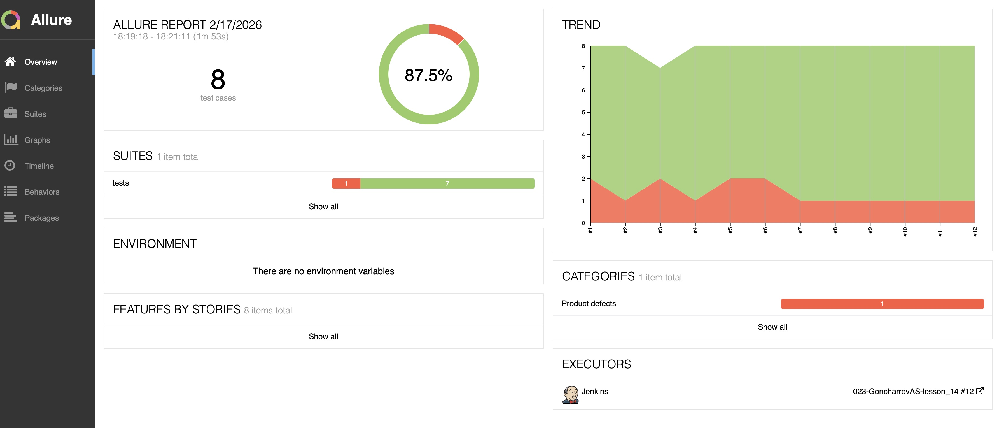
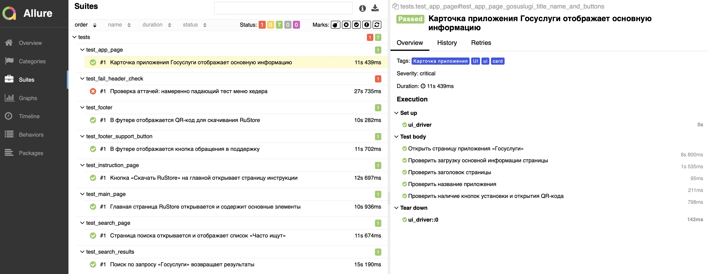
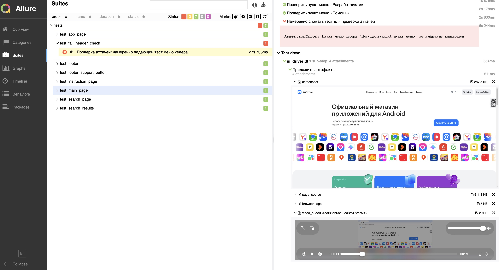
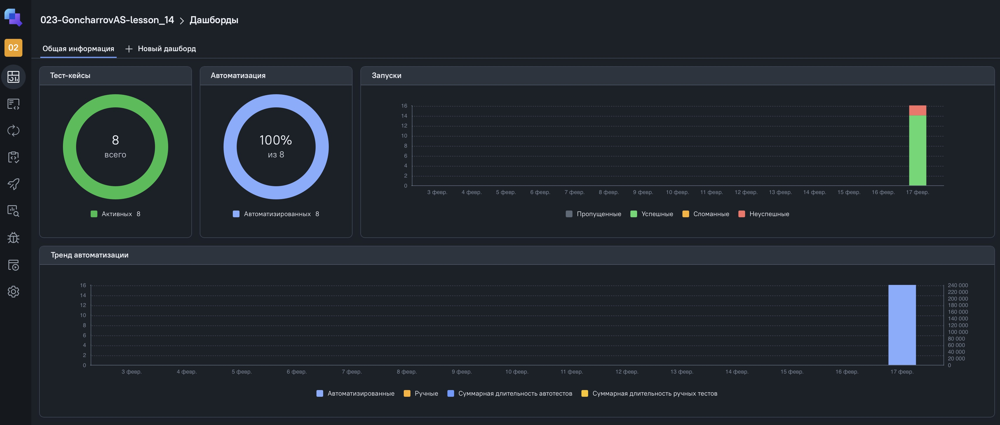
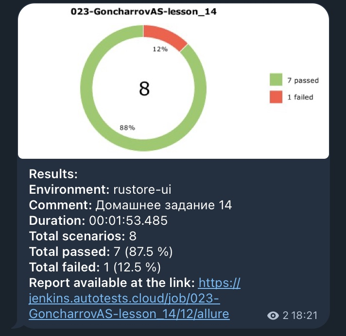

# 🧪 UI Test Automation Project

Автоматизация **UI-автотестов** для сайта **RuStore**.  


---

## 📑 Содержание

- [🛠 Стек технологий](#-стек-технологий)
- [🧩 Реализованные тесты](#-реализованные-тесты)
  - [🏠 Main page (test_main_page.py)](#-main-page-test_main_pagepy)
  - [⬇️ Instruction (test_instruction_page.py)](#-instruction-test_instruction_pagepy)
  - [🔍 Search page (test_search_page.py)](#-search-page-test_search_pagepy)
  - [🧪 Search results (test_search_results.py)](#-search-results-test_search_resultspy)
  - [📄 App page (test_app_page.py)](#-app-page-test_app_pagepy)
  - [🧾 Footer QR (test_footer.py)](#-footer-qr-test_footerpy)
  - [🆘 Footer support (test_footer_support_button.py)](#-footer-support-test_footer_support_buttonpy)
  - [🧨 Attachments (test_fail_header_check.py)](#-attachments-test_fail_header_checkpy)
- [▶️ Запуск](#️-запуск)
  - [Установка зависимостей](#установка-зависимостей)
  - [Запуск тестов](#запуск-тестов)
  - [Запуск с генерацией Allure-результатов](#запуск-с-генерацией-allure-результатов)
- [🖥 Запуск в Selenoid](#-запуск-в-selenoid)
- [⚙️ CI/CD в Jenkins](#️-cicd-в-jenkins)
- [📊 Allure Report](#-allure-report)
  - [Разделы отчёта (скриншоты)](#разделы-отчёта-скриншоты)
- [🧭 Интеграция с Allure TestOps](#-интеграция-с-allure-testops)
- [📬 Telegram-уведомления](#-telegram-уведомления)
  - [Пример уведомления (скриншот)](#пример-уведомления-скриншот)

---
## 🛠 Стек технологий

| Технология | Описание |
|-----------|----------|
| | язык разработки |
|  | тестовый фреймворк |
|  | обёртка над Selenium |
|  | драйвер для автоматизации браузера |
|  | отчёты о тестировании |
|  | управление тестами |
|  | удалённый запуск браузеров |
| | CI/CD |
|  | уведомления о сборках |

---

## 🧩 Реализованные тесты

### 🏠 Main page (test_main_page.py)
**Цель:** Проверка открытия главной страницы и базовых элементов.

### ⬇️ Instruction (test_instruction_page.py)
**Цель:** Переход по кнопке «Скачать RuStore» на страницу инструкции.

### 🔍 Search page (test_search_page.py)
**Цель:** Проверка страницы поиска и списка «Часто ищут».

### 🧪 Search results (test_search_results.py)
**Цель:** Проверка результатов поиска по запросу «Госуслуги».

### 📄 App page (test_app_page.py)
**Цель:** Проверка карточки приложения «Госуслуги».

### 🧾 Footer QR (test_footer.py)
**Цель:** Проверка отображения QR-кода в футере.

### 🆘 Footer support (test_footer_support_button.py)
**Цель:** Проверка кнопки обращения в поддержку в футере.

### 🧨 Attachments (test_fail_header_check.py)
**Цель:** Намеренно падающий тест для проверки аттачей.

---

## ▶️ Запуск

### Установка зависимостей
```bash
python -m venv .venv
source .venv/bin/activate
pip install poetry
poetry install
```
### Запуск тестов
```bash
poetry run pytest -v
```
### Запуск с генерацией Allure-результатов
```bash
poetry run pytest -v --alluredir=results
```
## 🖥 Запуск в Selenoid
Основные настройки указаны в `/Users/goncharov/qa_guru/lesson_14/core/browser.py`:
```bash
browserName: chrome
enableVNC: true
enableVideo: true
```
Видео и скриншоты автоматически прикрепляются к отчёту Allure.

---

## ⚙️ CI/CD в Jenkins
Jenkins job выполняет следующие шаги:

1. Клонирование репозитория  
2. Установка зависимостей  
3. Запуск UI-тестов в **Selenoid**  
4. Генерация **Allure Report**  
5. Уведомление в **Telegram**  

---

## 📊 Allure Report

Отчёт Allure содержит:

- пошаговое выполнение тестов  
- скриншоты  
- HTML-снимки DOM  
- видео прохождения тестов  
- логи браузера  

### Разделы отчёта (скриншоты)

- Allure report  
  [Аллюр отчет](https://jenkins.autotests.cloud/job/023-GoncharrovAS-lesson_14/12/allure/)

- Overview  
  

- Suites  
  

- Attachments  
  


---

## 🧭 Интеграция с Allure TestOps

- [Тестопс запуск](https://allure.autotests.cloud/launch/51774)

В рамках проекта настроено:
- Проект в Allure TestOps  
  

- Загрузка результатов тестов из Jenkins  
  

- Аналитика и история запусков  
  

---
## 📬 Telegram-уведомления

После завершения сборки Jenkins отправляет уведомление в Telegram, содержащее:

- окружение сборки  
- количество выполненных и пройденных тестов  
- ссылку на **Allure Report**  

### Пример уведомления (скриншот)

- Telegram message  
  

